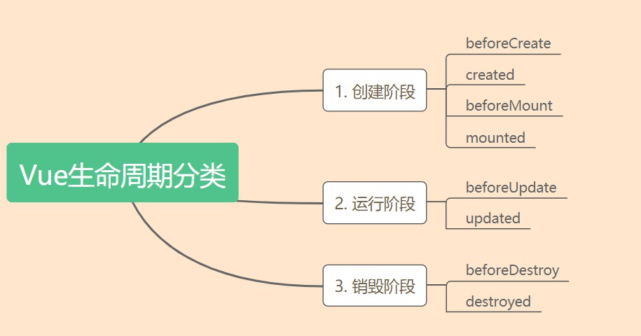
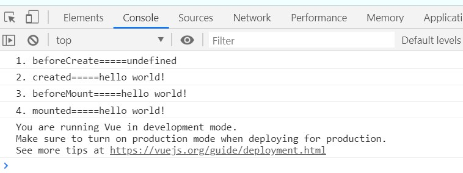
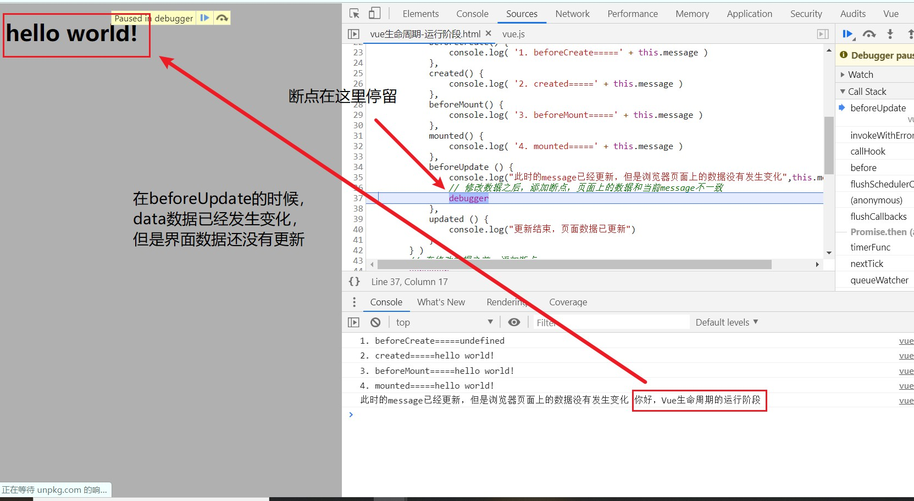
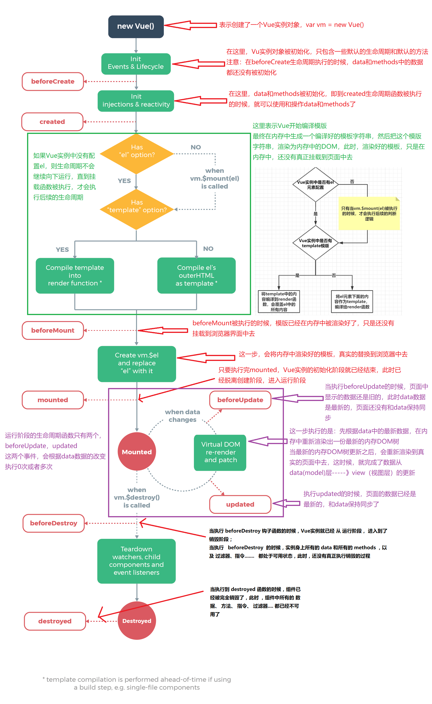

# Vue生命周期详解

[TOC]


## 一. Vue生命周期介绍

> **生命周期的含义：**从Vue实例创建，运行，到销毁期间，总是伴随着各种各样的事件，这些时间统称为生命周期
>
> **常见叫法：**生命周期钩子  == 生命周期函数 == 生命周期事件

### 1.1  生命周期分类



下面，将从这三个阶段，依次来学习Vue的生命周期


### 1.2 创建阶段

- **beforeCreate**：实例刚在内存中创建出来，还没有初始化 data和 methods，只包含一些自带额生命周期函数
- **created：**实例已经在内存中创建完成，此时data和methods已经创建完成
- **beforeMount：**此时已经完成了模版的编译，只是还没有渲染到界面中去
- **mounted：**模版已经渲染到了浏览器，创建阶段结束，即将进入运行阶段

**创建阶段生命周期Demo：**

- 我们可以通过在代码中添加 `debugger` 关键字来达到断点调试的功能，每一个`debugger`就相当于一个断点
- 添加断点调试后，我们可以查看每一个生命周期阶段的数据变化以及查看浏览器渲染时间
- <font color=red>可以通过断点调试调用栈的调用过程，来学习Vue源码</font>

```HTML
<!DOCTYPE html>
<html>

<head>
    <meta charset="utf-8">
    <title>vue-Demo</title>
    <script src="https://unpkg.com/vue/dist/vue.js" type="text/javascript" charset="utf-8"></script>
</head>

<body>
    <div id="app">
        <p>{{message}}</p>
    </div>
    <script type="text/javascript">
        var v = new Vue( {
            el: "#app",
            data: {
                message: "hello world!"
            },
            // 如果没有template,则会将el中元素当作template，如果有template，则会覆盖el中的dom
            template: "<div id='app'><h1>{{ message }}</h1></div>",
            // Vue实例刚刚被初始化，data和methods还没有值
            beforeCreate() {
                console.log( '1. beforeCreate=====' + this.message )
                debugger
            },
            // Vue实例创建完成，data和methods可以被使用了
            created() {
                console.log( '2. created=====' + this.message )
                debugger
            },
            // 内存中的Dom已经渲染完成，还没有显示到浏览器
            beforeMount() {
                console.log( '3. beforeMount=====' + this.message )
                debugger
            },
            //模版已经渲染到浏览器，创建阶段结束
            mounted() {
                debugger
                console.log( '4. mounted=====' + this.message )
            }
        } )
    </script>
</body>

</html>
```

运行结果：




### 1.3 运行阶段

- **beforeUpdate：**界面中的数据还是旧的，但是data数据已经更新，页面中和data还没有同步
- **中间处理过程（非生命周期，便于学习抽象化的中间处理过程）：**先根据data中的数据，在内存中渲染出一个新的DOM，当新的DOM树更新之后，会重新渲染到真实的界面中去，从而实现了从 数据层（model）---》视图层（view）的转换

- **updated：**页面重新渲染完毕，页面中的数据和data保持一致

**运行阶段Demo：**

- <font color=red>说明：代码拷贝即可直接使用，注意查看两次断点停留的地方message的变化，以及页面数据的变化</font>

```html
<!DOCTYPE html>
<html>

<head>
    <meta charset="utf-8">
    <title>vue-Demo</title>
    <script src="https://unpkg.com/vue/dist/vue.js" type="text/javascript" charset="utf-8"></script>
</head>

<body>
    <div id="app">
        <p>{{message}}</p>
    </div>
    <script type="text/javascript">
        var vm = new Vue( {
            el: "#app",
            data: {
                message: "hello world!"
            },
            // 如果没有template,则会将el中元素当作template，如果有template，则会覆盖el中的dom
            template: "<div id='app'><h1>{{ message }}</h1></div>",
            beforeCreate() {
                console.log( '1. beforeCreate=====' + this.message )
            },
            created() {
                console.log( '2. created=====' + this.message )
            },
            beforeMount() {
                console.log( '3. beforeMount=====' + this.message )
            },
            mounted() {
                console.log( '4. mounted=====' + this.message )
            },
            beforeUpdate () {
                console.log("此时的message已经更新，但是浏览器页面上的数据没有发生变化",this.message)
                // 修改数据之后，添加断点，页面上的数据和当前message不一致
                debugger
            },
            updated () {
                console.log("更新结束，页面数据已更新")
            }
        } )
        // 在修改数据之前，添加断点
        debugger
        vm.message = '你好，Vue生命周期的运行阶段'
    </script>
</body>

</html>
```

运行结果：




### 1.4 销毁阶段

- **beforeDestroy：**执行该方法的时候，Vue的生命周期已经进入销毁阶段，但是实例上的各种数据还出于可用状态
- **destroyed：**组件已经全部销毁，Vue实例已经被销毁，Vue中的任何数据都不可用


## 二. 生命周期解析图



