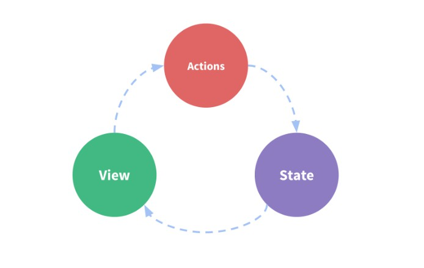
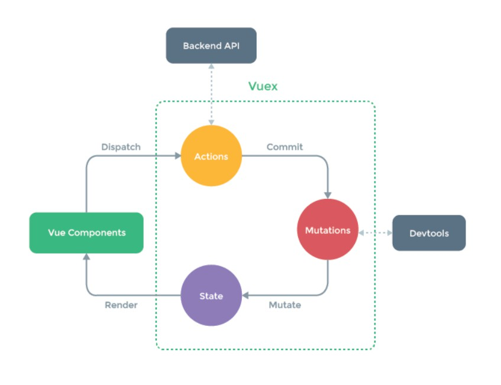

# Vuex详解

## 一. Vuex是什么

- 我们来看一下 [Vuex官网](https://vuex.vuejs.org/zh/)上的解释

> Vuex 是一个专为 Vue.js 应用程序开发的**状态管理模式**。它采用集中式存储管理应用的所有组件的状态，并以相应的规则保证状态以一种可预测的方式发生变化。Vuex 也集成到 Vue 的官方调试工具 [devtools extension](https://github.com/vuejs/vue-devtools)，提供了诸如零配置的 time-travel 调试、状态快照导入导出等高级调试功能。

由官网的介绍可知，Vuex类似于一个状态管理器，专门用来管理所有组件共享的状态，并且，只能以Vuex规定的方式去修改这些状态。

### 1.1 简单的状态管理

我们先通过一个实例来看一下Vue最基本的状态管理流程

~~~js
new Vue({
    //state
    data(){
        return {
            count:0
        }
    },
    //view
    template:'
{{count}}
',
    //action
	methods:{
        increment(){
            this.count++
        }
    }
})
~~~

在以上Vue实例中，我们把内容分为了三个模块：

- state：状态
- view：视图
- action：方法

他们的调用方式如下

但是当遇到多个组件共享状态的时候，单向的数据流将不再适用，

于是就出现了如下的Vuex状态管理

### 1.2 什么时候使用Vuex

- vuex适用于中大型应用

## 二. 开始使用Vuex

> 每一个 Vuex 应用的核心就是 store（仓库）。“store”基本上就是一个容器，它包含着你的应用中大部分的**状态 (state)**。Vuex 和单纯的全局对象有以下两点不同：
>
> 1. Vuex 的状态存储是响应式的。当 Vue 组件从 store 中读取状态的时候，若 store 中的状态发生变化，那么相应的组件也会相应地得到高效更新。
> 2. 你不能直接改变 store 中的状态。改变 store 中的状态的唯一途径就是显式地**提交 (commit) mutation**。这样使得我们可以方便地跟踪每一个状态的变化，从而让我们能够实现一些工具帮助我们更好地了解我们的应用

### 2.1 最简单的Vuex使用

1. 在对应的js文件中引入Vue和Vuex

2. 显示的使用Vuex   Vue.use(Vuex)

3. 创建 store仓库

   ~~~js
   import Vue from 'vue'
   import Vuex from 'vuex'
   Vue.use(Vuex)
   
   export default {
       state:{
           count:0
       },
       mutations:{
           imcrement(state){
               state.count++
           }
       }
   }
   ~~~

4. 通过`store.state`来获取对象，以及通过`store.commit`来触发状态改变

   ~~~js
   store.commit('increment')
   
   console.log(this.$store.state.count)		//1
   ~~~

**注意：每次改变状态，必须都通过 提交mutations的方式，不能使用 store.state.count直接修改，**

- 使用mutations提交的方式可以便于我们追踪到状态的变化，

## 三.核心概念

Vuex的核心概念主要包括以下几个部分

- State
- Getter 
- Mutations
- Action
- Module

### 3.1 State

- state 仅仅是一个状态树，它包含了所有组件共享的状态信息（即交给Vuex管理的所有属性都包含在state对象中）
- 在组件中通过 `store.state.属性名`来获取state中的属性

**实例**

~~~js
new Vue({
    el:'#app',
    render:c => c(App),
    store:new Vuex.Store({
        state:{
            count:0
        }
    }),
    mounted(){
        console.log(store.state.count)		//0
    }
})
~~~

**问题：每次调用都要使用 store.state.count调用，调用链太长，多次使用会比较麻烦**

**解决：使用mapState,将store.state.count映射为this.count，以后使用this.count即可调用**

~~~js
 new Vue({
    el:'#app',
    render:c => c(App),
    store:new Vuex.Store({
        state:{
            count:0
        }
    }),
    computed:{
        ...mapState(['count'])
    },
    mounted(){
        console.log("通过--store.state.count调用--",store.state.count)
        console.log("通过mapState,将store.state.count映射为this.count调用",this.count)
    }
})
~~~

### 3.2 Getter

- Getter常用于**对state状态的拓展**，或者是**对state进行过滤**，总而言之就是用来**对state中的状态进行多一步的处理，然后返回一个新数据**
- Getter类似于computed，它们的返回值会被缓存起来，直到它所依赖的值发生变化，它才会被重新计算

~~~js
//store.js

import Vue from 'veu'
import { mapState, mapGetters } from 'vuex'
Vue.use(Vuex)

export default {
    state:{
        count:0,
        firstName:'kobe',
        lastName:'blent',
    },
    getters:{
        fullName(){
            return state.firstName + state.lastName
        }
    }
}
~~~

~~~js
//someComponent.js

mounted () {
    console.log("通过--store.state.count调用--",this.$store.state.count)
    console.log("通过mapState,将store.state.count映射为this.count调用--",this.count)
    console.log("通过--store.getters.fullName调用--",this.$store.getters.fullName)
    console.log("通过--mapGetters将store.getters.fullName映射为this.fullName调用--",this.fullName)
},
computed: {
        ...mapState(['count','firstName','lastName']),
        ...mapGetters(['fullName']),
    },
~~~

### 3.3 Mutations

- 更改Vuex中store状态的**唯一方法**就是提交mutations
- motations必须是同步函数
- motation里面的方法，只能接收两个参数，第一个参数是 state，第二个参数是外部传进来的参数，当外部的参数包含多个的时候，可以将第二个参数包装为一个对象，所有的其它参数都作为该对象的属性

~~~js
//store.js

...
mutations:{
    increment(state){
        state.count++
    }
}
~~~

~~~js
//组件中调用
mounted () {
     setInterval(() => {
         //基本的提交
         this.$store.commit('increment')
         //映射之后的提交
         this.increment()

     },1000)
 },
methods: {
    ...mapMutations(['increment']),
}
    

~~~

### 3.4 Action

> Action 类似于Mutation，区别在于
>
> 1. Action提交的是Mutation，而不是直接变更状态
> 2. Action可以包含任意**异步操作**

~~~js
//store.js

...
action:{
    updateCountSync(context,data){
        setTimeout(() => {
            context.commit('increment')
        }, data.time);
    }
}
~~~

~~~js
//组件中调用

mounted () {
    //普通调用
    this.$store.dispatch('updateCountSync',{time:3000})
    //通过mapAction之后的调用
    this.updateCountSync({time:3000})
},
methods: {
    ...mapActions(['updateCountSync']),
}
~~~

### 3.5 Module

Vue允许我们将store分割成模块。每个模块拥有自己的 state,mutations,action,getter,甚至是嵌套子模块

~~~js
const moduleA = {
    state:{ ... },
    mutations:{ ... },
    getters:{ ... },
    actions:{ ... },
}

const moduleA = {
    state:{ ... },
    mutations:{ ... },
    getters:{ ... },
    actions:{ ... },
}
             
const store = new Vuex.Store({
	modules:{
		a:moduleA,
        b:moduleB,
	}
})
               
store.state.a		//模块A的状态
store.state.b		//模块B的状态
~~~

在module中，属性和方法的使用略有不同

#### 3.5.1 state

**普通调用**

~~~js
console.log(this.$store.state.title,this.$store.state.count)
console.log(this.$store.state.a.title,this.$store.state.a.count)
console.log(this.$store.state.b.title,this.$store.state.b.count)
~~~

**mapState调用**

~~~js
computed:{
    ...mapState({
        count:state => state.count,
        aCount:state => state.a.count,
        bCount:state => state.b.count,
        title:state => state.title,
        aTitle:state => state.a.title,
        bTitle:state => state.b.title,
    })
},
mounted(){
    console.log(this.title,this.count)
    console.log(this.aTitle,this.aCount)
    console.log(this.bTitle,this.bCount)
}
~~~

#### 3.5.2 getters

**普通调用**

~~~js
console.log(this.$store.getters['a/getTitile'])
console.log(this.$store.getters['b/getTitile'])
~~~

**mapGetters调用**

~~~js
//方法一
computed: {
    ...mapGetters(['fullName','a/getTitile','b/getTitile']),
},
mounted:{
    console.log(this['a/getTitile'])
    console.log(this['b/getTitile'])
}
    
//方法二
computed: {
    ...mapGetters({
        fullName:'fullName',
        aTitle:'a/getTitile',
        bTitle:'b/getTitile',
    }),
},
mounted:{
    console.log(this.aTitle)
    console.log(this.bTitle)
}
~~~

#### 3.5.3 mutations

**mapMutations调用**

~~~js
//方法一
mounted () {
    setInterval(() => {
        this.increment(),
        this['a/increment'](),
        this['b/increment']()
    },1000)
},
methods: {
    ...mapMutations(['increment','a/increment','b/increment']),
}
    
//方法二
 mounted(){
     setInterval(() => {
         this.increment();
         this.a_increment();
         this.b_increment();
     },1000)
 }
 methods: {
     ...mapMutations({
         increment:'increment',
         a_increment:'a/increment',
         b_increment:'b/increment'
     })
 }
~~~

#### 3.5.4 Action

同上