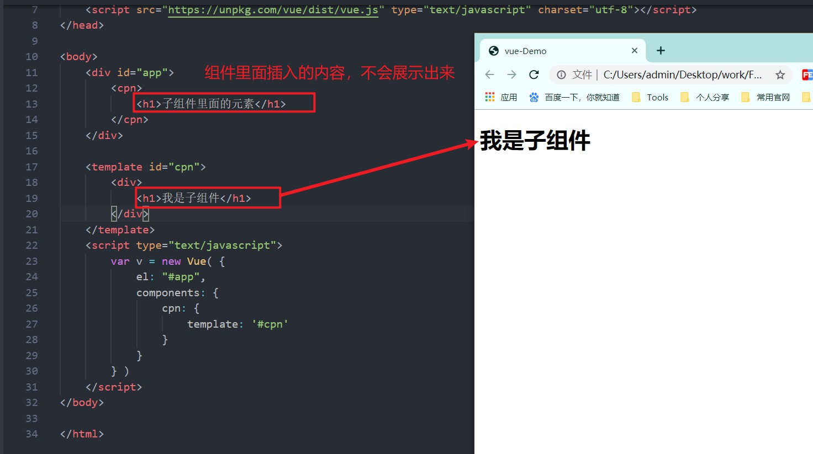
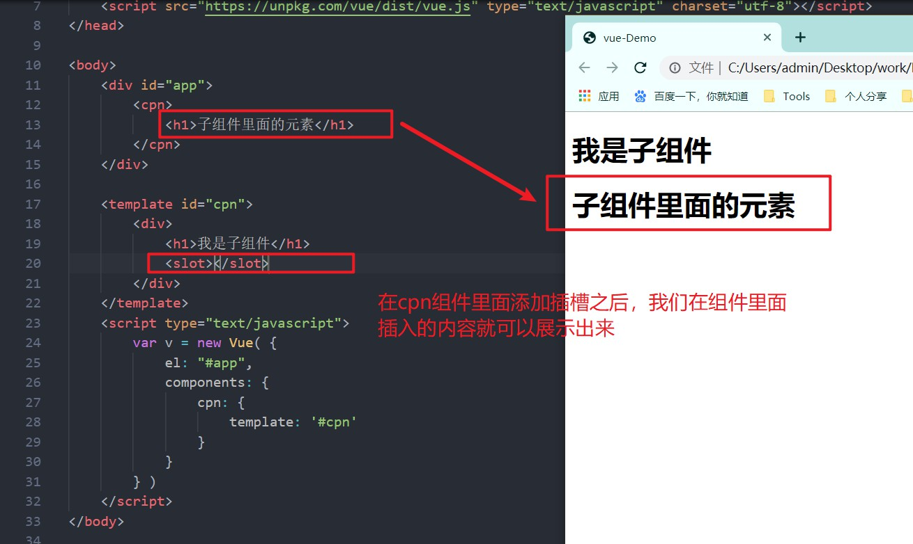
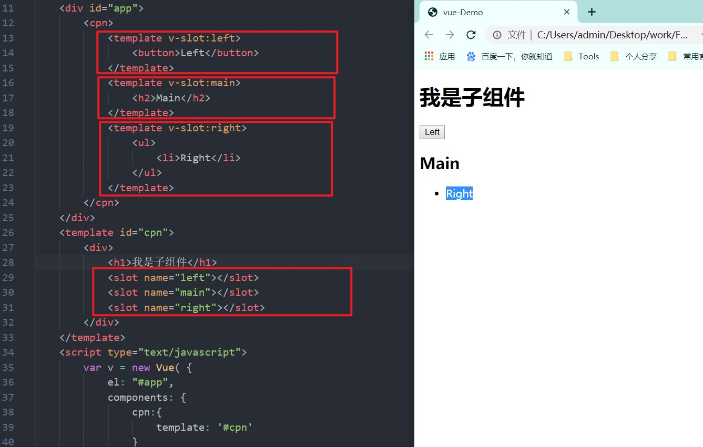
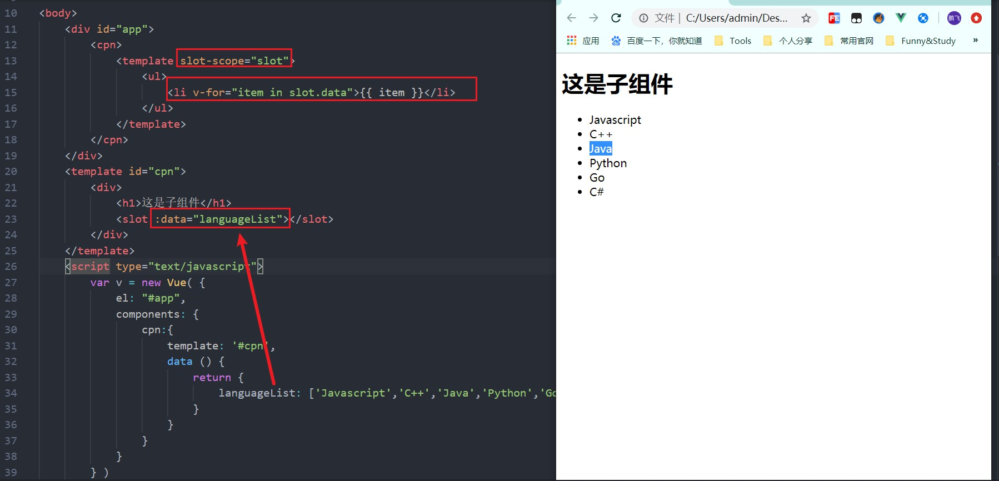

[TOC]

# Slot 插槽

> **什么是插槽：**
>
> - 在Vue中，插槽就是在组件标签里面，可以放入我们自定义的元素标签，从而呈现出不同的展示
> - 插槽的使用，使组件拥有了多态的属性

## 一. 插槽的基本使用

> 一般情况下,我们在组件的标签里面加入内容的时候,这部分内容是不会显示的,如

我们定义了一个子组件：cpn，并将子组件生命到了Vue实例中，在Vue实例中使用 cpn 组件，并且在子组件里面插入我们的自定义内容，

插槽的作用就是，使组件内插入的元素，可以展示在组件中相应的位置，如下，我们在子组件中添加了插槽标签之后，我们在子组件中添加的内容即可展示出来

**插槽的作用：**插槽可以让我们在组件中添加的内容展示出来，允许我们自由的在组件内定义要插入的内容

## 二. 具名插槽

> 有时候，我们需要用到多个插槽，这个时候，为了我们在组件中添加的内容能够被渲染到正确的插槽内，我们就需要为每个插槽定义一个名字，要插入的内容即可根据插槽的名字，插入对应的插槽
>
> **注意：**默认情况下，插槽的名字为 default，我们也可以将 default显示的声明出来

如下，我们在组件内声明了三个插槽，通过name属性，为每个插槽指定了名字

在Vue实例中，通过 template 标签，指定 v-slot: name 来将插入的内容绑定到对应的插槽

**具名插槽的简写：**

- 我们可以如下方式，实现具名插槽的简写
- 下面两种写法是一样的

~~~HTML
 <cpn>
     <template v-slot:left>
         <h2>具名插槽的一般写法</h2>
     </template>
     
     <template #left>
         <h2>具名插槽的简写</h2>
     </template>
</cpn>
~~~

## 三. 作用域插槽

> 作用域插槽是插槽里面最强大的一个功能，也是插槽里面最难理解的一个概念
>
> 通过上面的学习，我们知道，通过插槽，我们可以实现组件的多态，即同一个组件，我们插入不同的内容，就会有不同的展示。
>
> **作用：**在写入插槽的位置，获取原组件的data，来动态生成插槽插入的内容，实现根据不同的业务场景，实现不同的插槽内容
>
> **注意：**默认情况下，我们无法在定义插槽内容的地方访问原组件里面的内容，因为不在一个作用域，只可访问Vue实例中的数据

我们在 slot标签里面通过 v-bind 绑定了组件中的语言列表，在Vue实例中，通过 slot-scope=“slot” 获取到插槽作用域，即可在插槽里面使用组件中的数据，可以个性化，动态的制作插槽，这就是插槽作用域的使用

