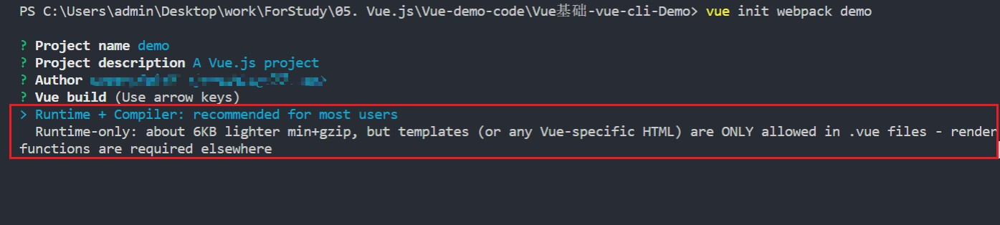
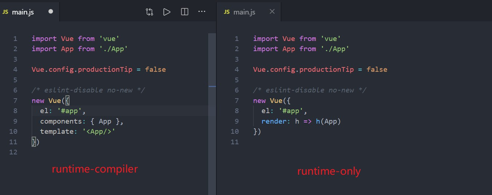

# runtime-compiler和runtime-only的区别

> 我们使用 vue init 命令创建脚手架的时候，会有如下选择
>
> - Runtime + Compiler
> - Runtime-only
>
> 那么它们究竟有什么区别呢，今天我们就来探讨一下

首先，我们分别通过这两种方式，创建Vue脚手架。我们来看一下两者的 main.js 有什么不一样

区别很明显，在 Vue 实例中，runtime-compiler 创建的项目中的参数是 compoennts 和 template，而在 runtime-only创建的项目中，参数是 render函数，这是他们最大的区别

## 组件渲染过程

其次，我们再来了解一下，组件是怎么被渲染到页面当中去的，这对我们理解上述问题起到关键性的作用

**template -->  ast --> render --> vDom --> 真实的Dom --> 页面**

- ast：抽象语法树
- vDom：虚拟Dom

可以发现，template最终还是会被渲染为 render函数，记住这个结论

## runtime-only

> - 我们在使用 runtime-only 的时候，需要借助 webpack的loader工具，将 `.vue` 文件编译为JavaScript，因为是在编译阶段做的，所以它只包含运行时的 Vue.js 代码，所以代码体积会更轻量。
>
> - 在将 `.vue` 文件编译为 JavaScript文件的过程中会将组件中的 template 模版编译为 `render` 函数，所以我们得到的是 `render` 函数的版本。所以运行的时候是不带编译的，编译是在离线的时候做的
> - template 会通过 `vue-template-compiler` 转换为 render 函数

## runtime-compiler

> - 因为在Vue中，最终渲染都是通过 render函数，如果写 template 属性，则会编译为 render 函数，那么这个编译过程会发生在运行时，所以需要带有编译器的版本
> - 编译过程会对性能有一定的损耗

## 结论

**runtime-only：** 将template在打包的时候，就已经编译为 render函数

**runtime-compiler：** 在运行的时候，才去编译 template

**结果：** 发布生产的时候，runtime-only 构建的项目代码体积更小，运行速度更快

**推荐使用runtime-only构建项目**