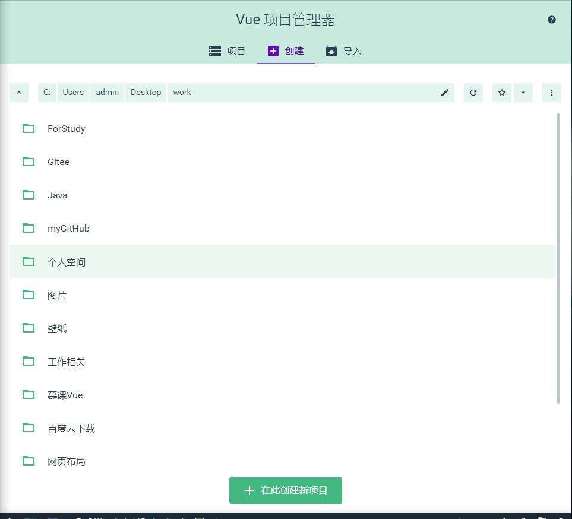
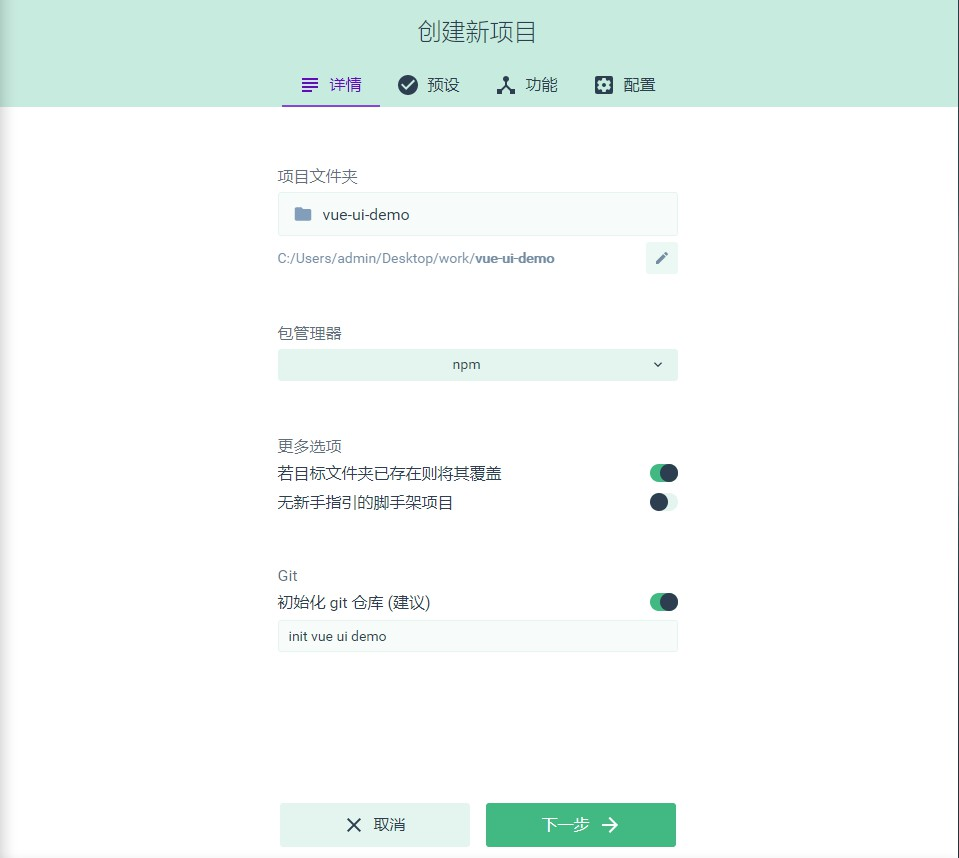
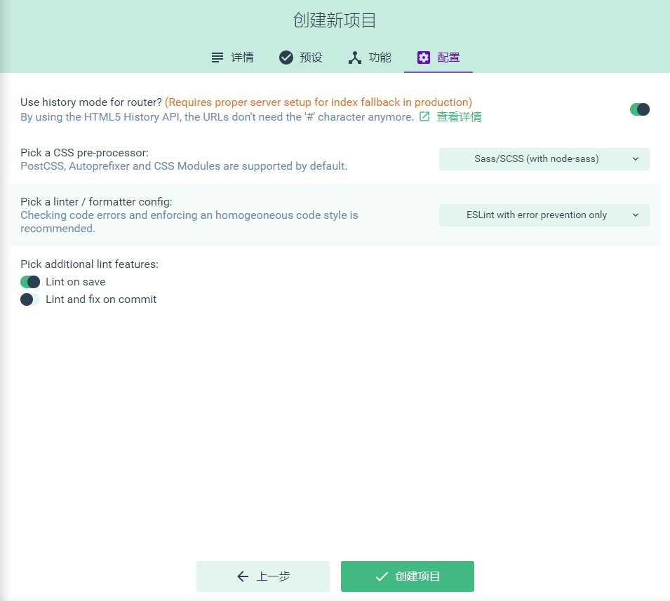
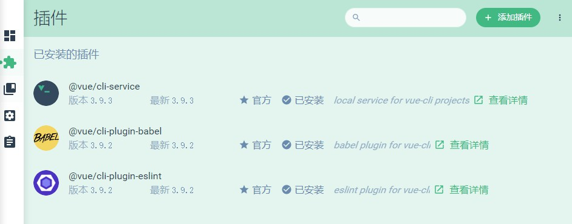
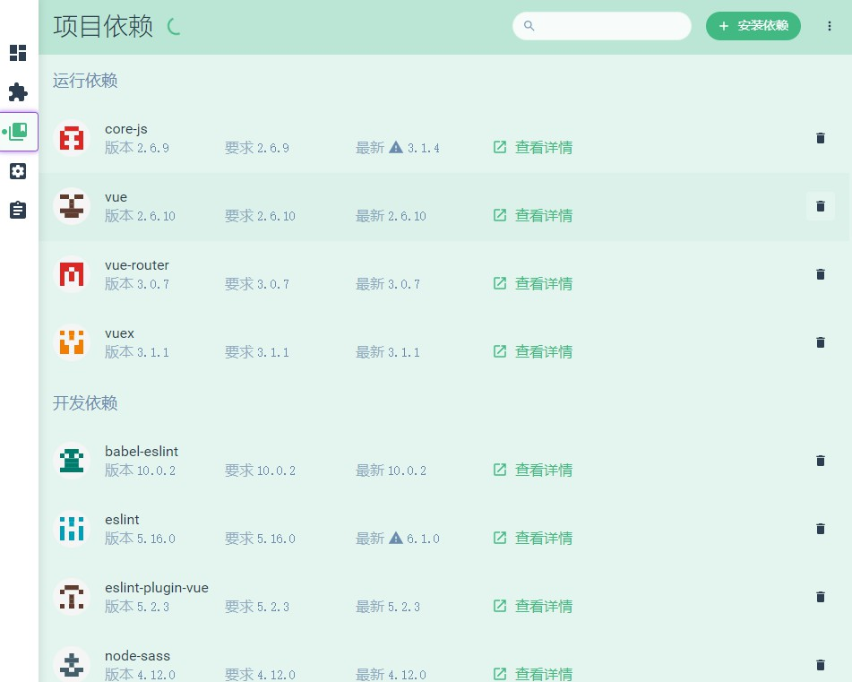
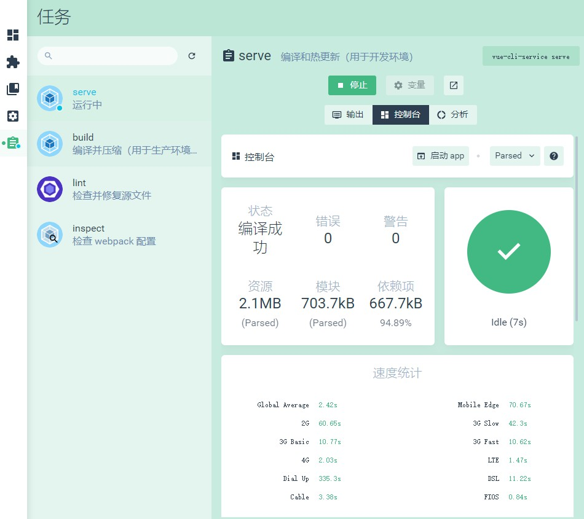

# 使用 vue ui快速创建项目

**使用前提：Vue-cli的版本是3.0以上**

可以在命令行查看当前vue-cli的版本

~~~shell
//查看当前vue-cli的版本
vue -V

//查看当前包含的vue命令
vue -h

//升级vue-cli到最新版本
vue i -g @vue/cli
~~~

## 开始使用

~~~shell
//在想要创建项目的文件夹下运行此命令
vue ui
~~~

- 自动跳转到如下界面

- 选择创建目录，点击创建新项目
- 填写如下项目信息

- 选择手动配置项目
- 选择预装的插件（后续也可以安装）
- 选择初始配置信息,创建项目

- 预设名设置：可以设置以该次创建作为以后的项目模版

- 完成创建，会展示如下目录

- **插件界面：**展示我们预安装的插件，并且可以通过添加插件来安装我们需要的插件

- **项目依赖：**展示我们目前的运行依赖和开发依赖，并且可以通过安装依赖来添加我们需要的依赖包

- **项目配置：**可以配置一些项目的基础信息和CSS设置

- **任务：**可以对项目进行编译，构建，运行，以及查看各种详细信息

- 构建完成